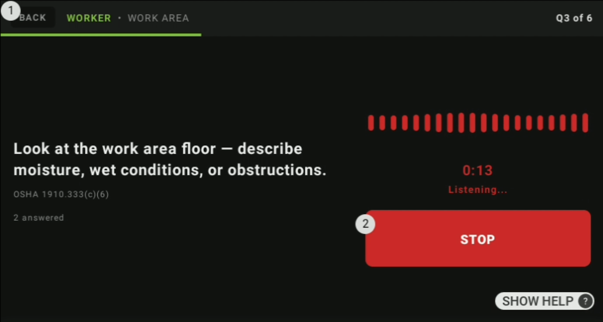
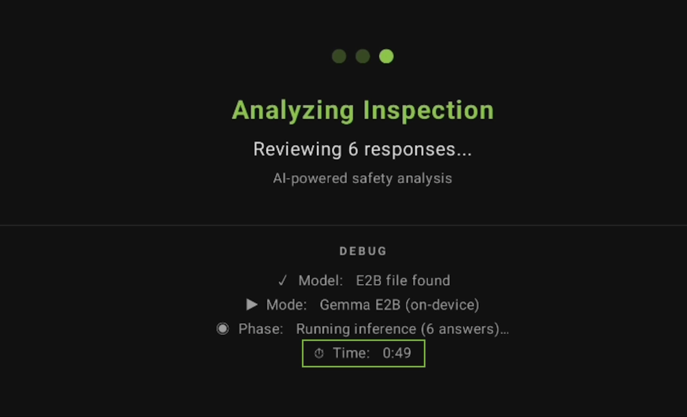
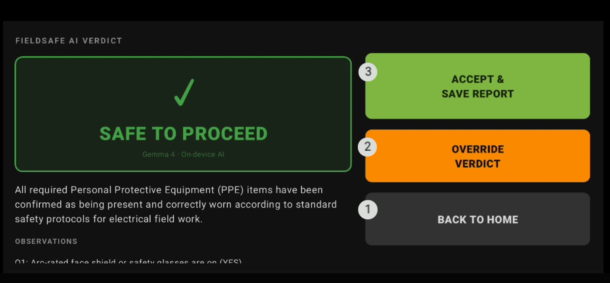
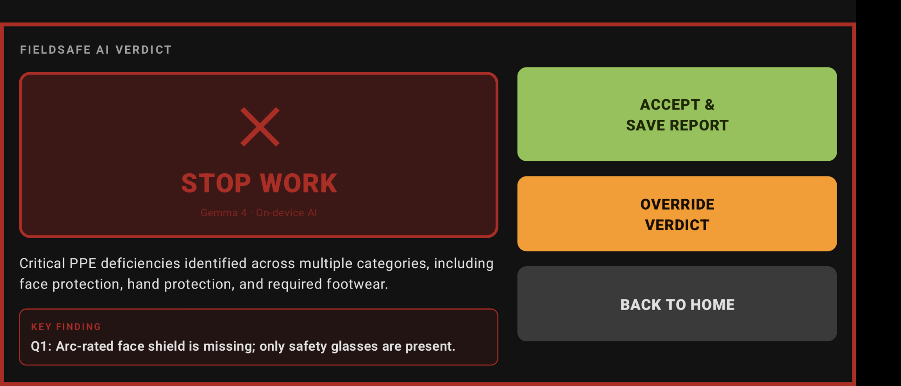

# FieldSafe Solar

FieldSafe Solar is an offline, hands-free safety inspection assistant for solar and electrical field workers, powered by on-device Gemma 4 E2B. It replaces disconnected paper checklists with a voice-first workflow — workers speak their answers, describe hazards, and capture photos without removing gloves or touching a screen. At the end of each inspection, Gemma performs conservative batch reasoning across the full checklist context and returns a GO / CAUTION / STOP_WORK recommendation for human review.

Built for RealWear HMT devices and field conditions where cloud connectivity, bare hands, and tablet-based workflows are not reliable.

Submitted to the [Gemma 4 Good Hackathon](https://www.kaggle.com/competitions/gemma-4-good-hackathon) — Safety Track (Kaggle × Google DeepMind)

---

## What It Does

FieldSafe Solar guides electrical/solar technicians through safety inspections using on-device voice AI. The worker speaks naturally; the app listens (Whisper STT), reasons over safety (Gemma 4 on-device), and responds aloud (Android TTS) — all without internet.

At the end of every inspection, the app generates a structured safety report with AI reasoning, worker confirmations, and a full voice transcript, stored locally for compliance audits.

**Four inspection types:**
- PPE Check — personal protective equipment verification (NFPA 70E §130.7)
- Inverter/Panel Pre-Task Check — lockout/tagout, de-energization (OSHA 1910.147)
- Work Area Check — site hazards and arc flash boundaries (NFPA 70E §130.2)
- Solar Commissioning — pre-energization PV checks (IEC 62446-1)

---

## Why Gemma 4 On-Device

Solar and electrical workers often operate in remote fields, rooftops, and underground locations where internet is unavailable. Cloud AI fails here. Gemma 4 Edge (E4B/E2B) runs entirely on the Android phone, delivering frontier reasoning with zero connectivity dependency.

Safety reasoning is conservative by design: the model defaults to WARN or STOP_WORK when uncertain. Workers must verbally confirm critical safety facts — the AI assists but never certifies.

> **Note:** The Gemma model requires a one-time download (~2 GB) before first use. After provisioning, no network connection is required during inspections.

---

## Technology Stack

| Layer | Technology |
|---|---|
| On-device AI | Gemma 4 E4B / E2B via **LiteRT-LM** (`.litertlm` format) |
| Vision / PPE Detection | ML Kit Image Labeling (on-device, real-time scan) |
| Speech-to-Text | Whisper.cpp tiny.en (bundled in assets) |
| Text-to-Speech | Android TextToSpeech |
| UI | Kotlin + Jetpack Compose (Material 3) |
| Camera | CameraX |
| Database | Room / SQLite (offline reports) |
| Device target | Android phone + RealWear HMT (hands-free) |

**LiteRT-LM** (`com.google.ai.edge.litertlm`) is Google's replacement for the deprecated MediaPipe LLM Tasks API. It uses the `.litertlm` model format from [HuggingFace litert-community](https://huggingface.co/litert-community).

---

## Architecture

```
Worker speaks
    → Whisper.cpp STT (on-device, bundled asset)
        → GemmaEdgeAnalyzer (LiteRT-LM Engine/Conversation API, multi-turn, standards-aware)
            → Android TTS (spoken response back to worker)
                → Room DB (report + transcript saved locally for audit)

Camera (live scan)
    → ML Kit Image Labeling (PPE / hazard detection, ~5s scan)
        → VisionFindings → GemmaEdgeAnalyzer (vision-aware prompts)
```

Key design decisions:
- **DemoStubAnalyzer fallback** — if no model files are present, app falls back to a deterministic demo stub so the demo never crashes
- **Safety-conservative parsing** — unknown AI confidence → LOW; unknown decision → WARN
- **Single-column RealWear layout** — all buttons ≥ 80dp height for glove/head-mounted operation

---

## What We Built

- Android app in Kotlin / Jetpack Compose, optimized for RealWear HMT (single-column layout, 80dp+ buttons, landscape-locked)
- Four local checklist templates covering 31 standards-mapped inspection points
- Voice-button workflow: YES / NO / SKIP / DESCRIBE / CAPTURE — no touchscreen required during inspection
- On-device speech recognition via Whisper.cpp tiny.en (bundled in assets, JNI wrapper)
- CameraX evidence capture with voice trigger
- ML Kit image labeling and OCR (labels and text included in Gemma batch prompt)
- On-device Gemma 4 E2B inference through LiteRT-LM — no cloud API call during inspection
- Structured JSON safety verdict: GO / CAUTION / STOP_WORK with Gemma reasoning summary
- Room database persistence for all inspections, transcripts, and evidence metadata
- Human reviewer override flow before finalizing any inspection result
- PDF report export via FileProvider (shareable audit trail)
- Android TTS spoken feedback with offline voice fallback
- In-app Gemma model download with HuggingFace authentication
- `DemoStubAnalyzer` fallback — full UI flow always demonstrable even without model on device

---

## Screenshots / Demo

> **Demo video:** [Watch on YouTube](https://youtu.be/HCzSYi_pLXY)
>
> **APK download:** [Download from GitHub Releases](https://github.com/applivity-com/FieldSafeSolar/releases/tag/v1.0.0)

| Voice Inspection | Gemma On-Device Inference |
|:---:|:---:|
|  |  |

| Safe to Proceed (GO) | Stop Work |
|:---:|:---:|
|  |  |

---

## Quick Start

### 1. Clone and build

```bash
git clone https://github.com/applivity-com/FieldSafeSolar.git
cd FieldSafeSolar/android-app
./gradlew assembleDebug
```

**Requires:** JDK 21, Android SDK 34, NDK r27+ (for Whisper.cpp JNI).

### 2. Configure local.properties

Create `android-app/local.properties` (gitignored — never committed) with:

```
sdk.dir=/path/to/your/Android/sdk
HF_TOKEN=hf_xxxxxxxxxxxxxxxxxxxxxxxxxxxxxxxxxxxx
MODEL_DOWNLOAD_URL=https://huggingface.co/litert-community/gemma-4-E2B-it/resolve/main/gemma-4-E2B-it.litertlm
```

- **`HF_TOKEN`** — a [HuggingFace read token](https://huggingface.co/settings/tokens). The Gemma 4 litert models are gated; you must accept the license on HuggingFace before the token will grant access.
- **`MODEL_DOWNLOAD_URL`** — the direct `.litertlm` download URL from [litert-community on HuggingFace](https://huggingface.co/litert-community).

These values are compiled into `BuildConfig` at build time and used by the in-app model download screen.

### 3. Get the Gemma 4 model

**Option A — In-app download (recommended):** After installing, open the app and use the model download screen. It fetches the model directly to the device using the token you configured above.

**Option B — Manual via adb:** Skip the token setup and push models directly:
```bash
adb push gemma-4-E2B-it.litertlm \
    /sdcard/Android/data/com.applivity.fieldsafesolar/files/models/
```

Download `.litertlm` files from [litert-community on HuggingFace](https://huggingface.co/litert-community) (requires HuggingFace login + license acceptance).

### 4. Install and run

```bash
adb install android-app/app/build/outputs/apk/debug/app-debug.apk
```

**Note:** If no model files are present, the app automatically falls back to `DemoStubAnalyzer` with realistic pre-scripted responses — the full UI flow is demonstrable either way.

---

## Full Voice Inspection Loop

1. **Home screen** — tap an inspection type (PPE, Inverter/Panel, Work Area, Solar Commissioning)
2. **Scan screen** — ML Kit live camera scan runs ~5s; detects PPE presence, hazards, labels equipment
3. **Voice interaction** — multi-turn Gemma conversation, guided by standards-aligned checklist
   - Whisper transcribes worker speech on-device
   - Gemma reasons over evidence + vision findings + applicable standard (e.g. "NFPA 70E §130.7")
   - Evaluates: PASS / WARN / FAIL / STOP_WORK; spoken aloud via TTS
4. **Repeat** for each checklist item (31 inspection points across 4 types, each citing a safety standard)
5. **Generate report** — Gemma produces structured JSON: summary, decision, standards referenced
6. **View report** — full audit trail: AI decision, worker confirmations, standard citations, transcript

---

## Project Structure

```
fieldsafe-solar/
├── android-app/                # Main Android app (Kotlin + Compose)
│   ├── app/src/main/kotlin/com/example/fieldsafesolar/
│   │   ├── data/               # Repositories, Room DB, data models
│   │   │   ├── repository/     # GemmaEdgeAnalyzer, WhisperCppSTT, MLKit, etc.
│   │   │   ├── db/             # Room entities, DAOs, converters
│   │   │   └── model/          # Data classes
│   │   ├── domain/             # Interfaces (AiSafetyAnalyzer, AudioRecorder, etc.)
│   │   ├── presentation/       # ViewModels
│   │   ├── ui/                 # Composable screens + components
│   │   └── di/                 # ServiceProvider (dependency wiring)
│   ├── whisper.cpp/            # Whisper.cpp C++ source (git submodule)
│   └── whispercpp-lib/         # Android JNI wrapper for Whisper
└── README.md
```

Model files (`.litertlm`) are not committed — they are large binaries fetched separately (see Quick Start).

---

## Toolchain

| Component | Version |
|---|---|
| AGP | 8.5.2 |
| Gradle | 8.7 |
| Kotlin | 2.3.21 |
| KSP | 2.3.7 |
| Java | 21 |
| Room | 2.8.4 |
| LiteRT-LM | 0.11.0-rc1 |
| compileSdk / targetSdk | 34 |
| minSdk | 26 (Android 8) |

---

## Safety Design Principles

1. **Never certify — only assist.** AI uses language like "appears", "not visible", "requires confirmation".
2. **Safety-conservative defaults.** Uncertain AI output → WARN. Unknown confidence → LOW.
3. **Worker confirmation required.** AI never concludes safety without worker verbal confirmation of critical facts (lockout, de-energization, PPE presence).
4. **Always auditable.** Every inspection produces a structured report with AI reasoning, worker transcript, and evidence photos.
5. **Demo resilience.** `DemoStubAnalyzer` is never removed — the app always works for demos even without model files on device.

---

## Known Limitations

- **Inference time:** Final Gemma analysis takes approximately 60–80 seconds on CPU-only wearable hardware. The app performs one batch inference at the end of the checklist rather than per-question, so Gemma can reason across the full inspection context.
- **Model provisioning:** The Gemma model (~2 GB) is not bundled in the APK. It requires a one-time download before first use. After provisioning, no network connection is required during inspections.
- **Photo analysis pipeline:** ML Kit provides fast on-device image labels and OCR text. These are included in the Gemma batch prompt; photos are not passed directly to Gemma as visual input.
- **Cross-modal contradiction detection:** The app does not automatically detect contradictions between spoken answers and photo evidence (e.g., a worker says gloves are on while a photo shows bare hands). Human reviewer judgment remains essential.
- **Demo mode:** If no Gemma model files are present on the device, the app falls back to `DemoStubAnalyzer` — a deterministic stub with scripted realistic responses. This exists so the full UI flow is always demonstrable. It is never used as a substitute for real inference in field use.
- **Decision support only:** FieldSafe Solar is a hackathon prototype and AI-assisted decision-support tool, not a certified compliance system. Final authority for all safety decisions remains with a qualified human reviewer.

---

## Hackathon Submission

- **Competition:** Gemma 4 Good Hackathon (Kaggle × Google DeepMind)
- **Deadline:** May 18, 2026
- **Model:** Gemma 4 E4B-it / E2B-it (`.litertlm` format, LiteRT-LM API)

**Eligible tracks:**

| Track | Justification |
|---|---|
| **Safety** | Primary use case — AI-assisted occupational safety for electrical/solar workers, citing NFPA 70E, OSHA, IEC standards |
| **LiteRT** | Entire inference stack uses LiteRT-LM (`com.google.ai.edge.litertlm`), the latest on-device API |
| **Cactus** | Android-first deployment, optimized for RealWear head-mounted device (glove-friendly, voice-only UX) |
